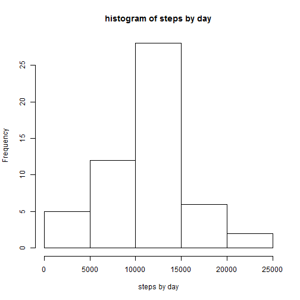

# Reproducible Research: Peer Assessment 1


## Loading and preprocessing the data


```r
data <- read.csv("activity.csv", colClasses = c("numeric", "Date", "numeric"))
```

## What is mean total number of steps taken per day?

The mean total steps by day is 10767 and the median is 10766. See below for analysis.


```r
nonNAdata <- data[!is.na(data$steps), ] ## Takes out the NA values

templist <- split(nonNAdata$steps, nonNAdata$date) ## groups steps by day

stepsbyday <- simplify2array(lapply(templist, sum, simplify = TRUE)) ## find total number of steps by day

hist(stepsbyday, main = "histogram of steps by day", xlab = "steps by day") ## make a histogram
```

 

```r
mean(stepsbyday) ## find the mean
```

```
## [1] 10767
```

```r
median(stepsbyday) ## find the median
```

```
## [1] 10766
```
## What is the average daily activity pattern?

The interval containing the max steps taken is the 835th interval. See below for analysis. 


```r
templist2 <- split(nonNAdata$steps, nonNAdata$interval) ## groups steps by intervals

avgStepsPerInterval <- simplify2array(lapply(templist2, mean, simplify = TRUE))## find the mean across all days for each interval

##Plotting the graph

plot(unique(nonNAdata$interval), avgStepsPerInterval, type = "l", xlab = "5 min intervals", ylab = "mean steps taken across all days for each interval")
```

 

```r
names(avgStepsPerInterval[avgStepsPerInterval == max(avgStepsPerInterval)]) ## finding the interval containing the most steps taken 
```

```
## [1] "835"
```

## Imputing missing values
The total number of missing values is 2304. The missing values will be imputed
with the mean interval values across all days. The new mean is 10767.19. The new median is 10767.19. See below for analysis. The new mean and median differs from
the original slightly. THe effect of imputing the missing values is raising
the mean of daily total steps slightly. See below for analysis.


```r
length(data[is.na(data$steps), "steps"]) ## finding the total number of missing values
```

```
## [1] 2304
```

```r
stepswithNAfilled <- replace(data$steps, is.na(data$steps), avgStepsPerInterval) ## repalces NA's with mean steps across all days for each interval


newdata <- data.frame(stepswithNAfilled, data$date, data$interval) ##constructs a new data set with NA's replaced with interval mean steps

templist3 <- split(newdata$stepswithNAfilled, newdata$data.date) ## group steps by date

totalstepsperdaywithna <- simplify2array(lapply(templist3, sum, simply = TRUE)) ## calculate steps per day 

hist(totalstepsperdaywithna, main = "steps per day with filled na", xlab = "steps per day with filled na") ## make the histogram
```

 

```r
mean(totalstepsperdaywithna) ## mean of steps per day with Na imputed
```

```
## [1] 10767
```

```r
median(totalstepsperdaywithna) ## median of steps per day with NA imputed
```

```
## [1] 10767
```


## Are there differences in activity patterns between weekdays and weekends?

The graphs show that there are clearlly more activity during weekends. See below
for analysis. 


```r
x <- weekdays(newdata$data.date) ## get the weekday values of dates 

newdata$newcol <- sapply(x, function(y){if(y == "Sunday" | y == "Saturday"){y <- "weekend"}else{y <- "weekday"}}) ## creating a new column of factor groups consisting of weekend or weekdays


weekdaydata <- newdata[newdata[, "newcol"] =="weekday", c("stepswithNAfilled", "data.date", "data.interval")] ##subset the data for weekdays only
temporary1 <- split(weekdaydata$stepswithNAfilled, weekdaydata$data.interval)
 ##splits the data by 5 min intervals
meanstepsweekdays <- sapply(temporary1, mean) ##mean interval steps for all week days. This will go on the y-axis graph for week days. 

weekenddata <- newdata[newdata[, "newcol"] =="weekend", c("stepswithNAfilled", "data.date", "data.interval")] ##subset the data for weekends only
temporary2 <- split(weekenddata$stepswithNAfilled, weekenddata$data.interval)
## splits the data by 5 min intervals 
meanstepsweekends <- sapply(temporary2, mean) ##mean interval steps for all weekends. This will go on the y-axis graph for weekends
```

Finally, we are ready to make our graphs!


```r
par(mfrow = c(2, 1))
plot(unique(weekenddata$data.interval), meanstepsweekends, main = "weekends", 
     xlab = "weekends", ylab = "steps")
plot(unique(weekdaydata$data.interval), meanstepsweekdays, main = "weekdays", 
     xlab = "weekdays", ylab = "steps")
```

 
